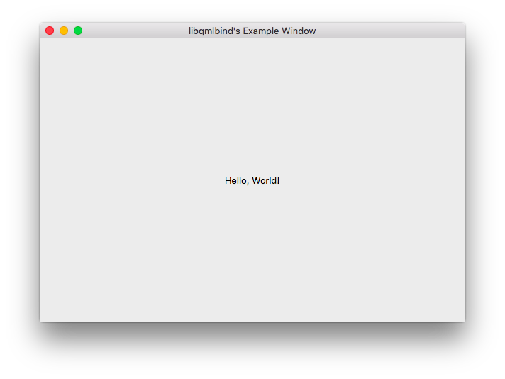

# libqmlbind-sys

Unsafe Rust binding to [libqmlbind](https://github.com/seanchas116/libqmlbind/),
a [Qt Quick](http://doc.qt.io/qt-5/qtquick-index.html) C library for binding QML.


## Initial Generation

[bindgen](https://github.com/crabtw/rust-bindgen) was used to create the binding.

Note that `libqmlbind`'s `value.h` includes `stdlib.h`, which (at least on my
_El Capitan_ Mac with XCode 7.3) prevents bindgen from doing its job.

The include was commented out for the conversion:

```sh
$ sed -ibak 's|.*#include <stdlib.h>|// #include <stdlib.h>|' libqmlbind/qmlbind/include/qmlbind/value.h
bindgen --builtins libqmlbind/qmlbind/include/qmlbind.h > src/lib.rs
$ sed -ibak 's|.*#include <stdlib.h>|#include <stdlib.h>|' libqmlbind/qmlbind/include/qmlbind/value.h
```


## Compilation


```sh
$ cargo build
```

**NOTE**: The cargo build script (`build.rs`) only supports OSX for now. It should
be relatively easy to modify it to support more platforms.


### Example

Build example:

```sh
$ cargo build --example hello_world
```


#### **NOTE**

For an unknown reason, the resulting binary does has an `rpath` issue on
OSX: It does _not_ contain `LC_RPATH`:

```sh
$ otool -l target/debug/examples/hello_world | grep LC_RPATH
```

Because of this, the Qt frameworks components will not be found when running:

```
$ ./target/debug/examples/hello_world
dyld: Library not loaded: @rpath/QtCore.framework/Versions/5/QtCore
  Referenced from: ${HOME}/qmlrsng.git/libqmlbind-sys/./target/debug/examples/hello_world
  Reason: image not found
Trace/BPT trap: 5
```

The only workaround I've found was to change the `@rname` in the binary with a
full path to Qt using `install_name_tool`:

```
install_name_tool -change @rpath/QtCore.framework/Versions/5/QtCore ${HOME}/Qt/5.7/clang_64/lib/QtCore.framework/Versions/5/QtCore target/debug/examples/hello_world
install_name_tool -change @rpath/QtNetwork.framework/Versions/5/QtNetwork ${HOME}/Qt/5.7/clang_64/lib/QtNetwork.framework/Versions/5/QtNetwork target/debug/examples/hello_world
install_name_tool -change @rpath/QtGui.framework/Versions/5/QtGui ${HOME}/Qt/5.7/clang_64/lib/QtGui.framework/Versions/5/QtGui target/debug/examples/hello_world
install_name_tool -change @rpath/QtQml.framework/Versions/5/QtQml ${HOME}/Qt/5.7/clang_64/lib/QtQml.framework/Versions/5/QtQml target/debug/examples/hello_world
install_name_tool -change @rpath/QtWidgets.framework/Versions/5/QtWidgets ${HOME}/Qt/5.7/clang_64/lib/QtWidgets.framework/Versions/5/QtWidgets target/debug/examples/hello_world
```

The script `./fix_qt_rpath.sh` will perfom these tasks. It assumes a `QTDIR` in
`${HOME}/Qt/5.7/clang_64`. Export the variable to something else if Qt is installed
elsewhere.

**NOTE** Untested using Qt from homebrew.


