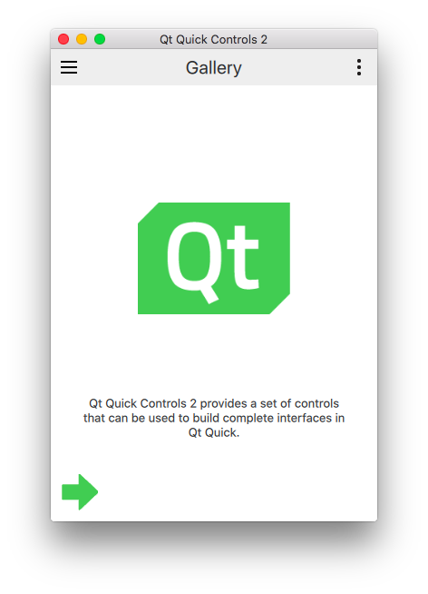

# gallery

**NOTE**: The `gallery` example is a QML showcase of Qt Quick Controls 2,
which requires with Qt 5.7.





This example requires a build script to compile the resource as a library
and link it.

By default, Qt from qt.io's installer will be picked-up. This one is
normally installed in `${HOME}/Qt/${QT_VER}/${QT_COMP}` (for example
`${HOME}/Qt/5.7/gcc_64`).

To use a different one, set the environment variable `QT_DIR` before
running `cargo`. For example, to use Qt installed from your Linux
package manager:

```
QT_DIR=/usr cargo build
```


## Compile

```
cargo build
```

## Fix rpath

Until the `rpath` issue is fixed on OSX, run this:

```
./fix_qt_rpath.sh
```

## Run

Note that the `rpath` for the resource library is asbent completely. For now,
simply copy the library files beside the binary:

```
cd target/debug
cp build/gallery-*/out/*galleryresources* .
./gallery
```
